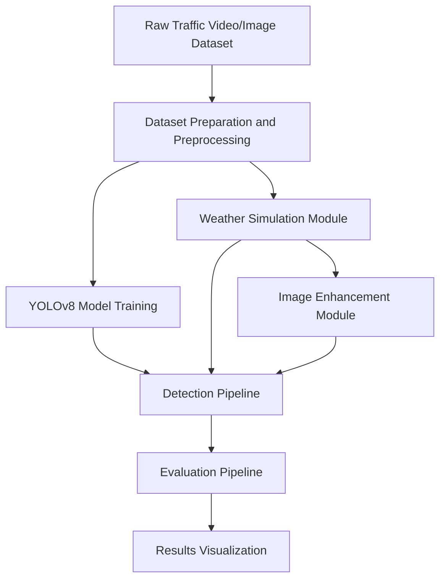

# Indian Traffic Vehicle Detection Under Adverse Weather Conditions

This project implements an end-to-end framework for detecting Indian-specific traffic vehicles using a Custom YOLOv8 model under simulated adverse weather conditions. The framework includes dataset pre-processing, weather simulation (rain, fog, snow, wind), image enhancement techniques (CLAHE, Histogram Equalization, Dehazing, Gamma Correction), custom YOLOv8 training, and real-time inference and evaluation.

## System Architecture



## Directory Structure

- `dataset/`: Contains data preparation scripts and YOLO dataset configuration.
- `weather_simulation/`: Scripts for simulating rain, fog, snow, and wind motion blur.
- `enhancement/`: Scripts for image fidelity recovery like CLAHE and Dehazing.
- `training/`: YOLOv8 training scripts.
- `detection/`: Real-time tracking and detection logic.
- `evaluation/`: Scripts for comparing metrics and generating charts.
- `models/`: Storage for custom PyTorch model weights.
- `results/`: Visual outputs, graphs, and bounding box visualizations.

## Setup Instructions

1. Install dependencies:
   ```bash
   pip install -r requirements.txt
   ```
2. Place your raw traffic images or videos in the appropriate dataset folders.
3. Follow the execution order of the modules to extract frames, simulate weather, train the model, and evaluate the results.
